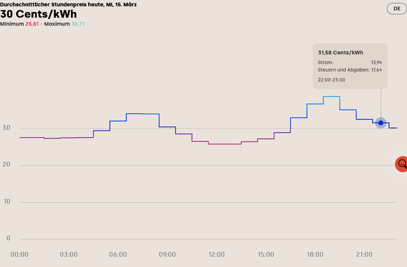
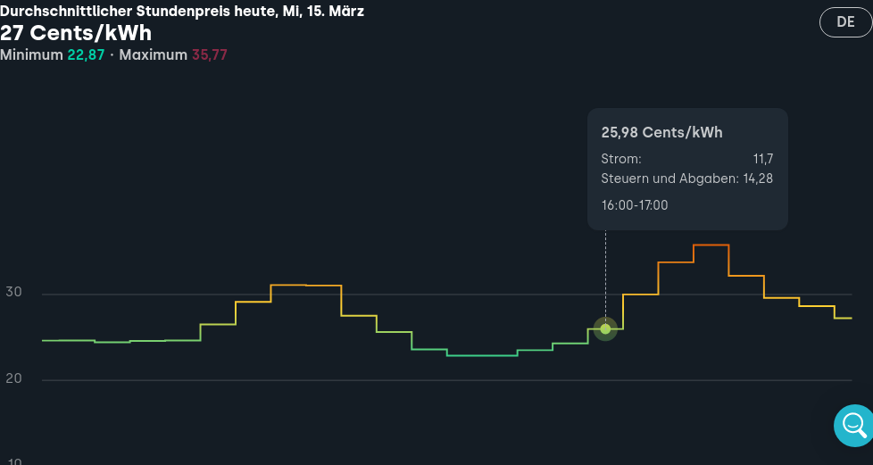
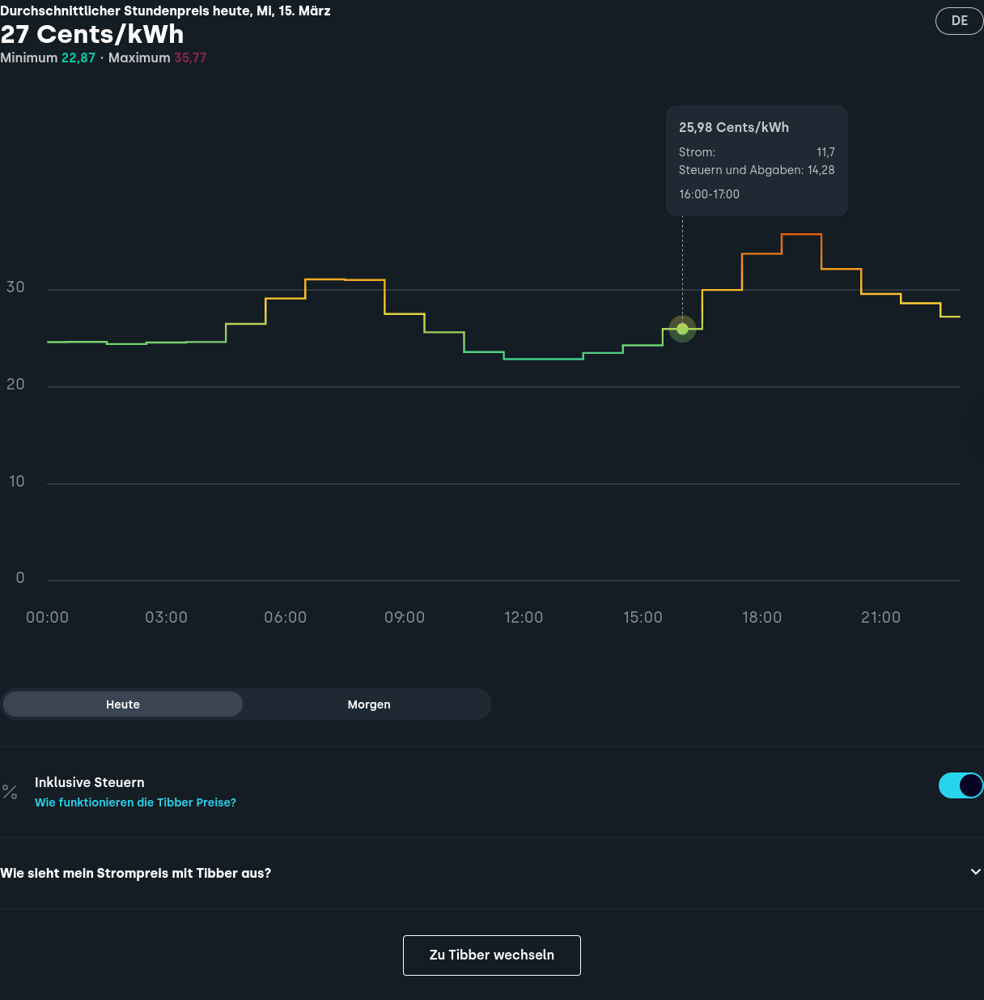

# Preface
Getting ready for Smart Grid Integration

This is to document how I'm grappling with Smart Grid Integration.

# Equipment
I'd love to integrate

- Chinese Solar Generator with approx. 10 kWp,
- Chinese Battery having a capacity of 20 kWh,
- Austrian Wallbox capable of 22kW charging,
- German Electric Vehicle with approx. capacity of 40 kWh,
- Not-So-German Heat Pump (normally 2..4 kW, with additional electrical heating of 12kW).

All the stuff is networked and has various - incompatible, of course - APIs.

# Totally unfounded observations
- Our grid sucks. There's worse but there's also much better. Why? Some time ago EU regulations degraded grid capacity: In the 70s there were massive capacities for residential areas (nuclear power, everybody had electrical heating). Then, EU regulations downgraded the minimum standard (and no one wanted to pay for more than the (newly set) bare minimum). So we now have residential areas which are unfit for large electrical loads (think EV, heat pump,...). I'm happy to live in a house having 3x50 Amps breakers only to have these downgraded to 35 Amps). Finger to you! And a big finger to our officials unable to rectify this mess, instead trying to push electrification while at the same time talking about forced limiting of consumption. 
- Could someone please fix this mess of incompatible APIs and standards? EU? See above...
-

# What I've tried...

## evcc for automated vehicle charging when having surplus energy
Upsides:
- Works with the solar generator and battery (Modbus TCP local network API) .
- Works with the car (Manufacturer Web API)
- Initially worked with the wallbox (local network https API).

Long story short: It sucks. 
- First, they broke my wallbox integration by pushing an update that made sponsorship mandatory for my type of wallbox. 
- Then, there's that "my way or the highway" philosophy. There is no way of manually starting a charge (i.e. via the wallbox app or an RFID card). That's a no-go for my significant other...  Some ideas die fast.

So I threw that one out. Next idea for surplus charging is hacking a solution with my home automation server.

## Getting Pricing Data for variable electricity tariffs.
There's two large consumers (car and heat pump). These loads can be shifted to off-peak times when electricity is much cheaper. That makes having a variable electricity tariff quite logical. Additionally, there's the battery which can be charged when electricity is cheap. but first, we need to get a feel for it. So we need data... Theres different tariffs but all are based on day ahead traded electricity. So we need to access that data. Multiple possible solutions to get data from
- Spot Market exchange (EPEX)
- directly from electricity company (Tibber / Awattar)
- EU Transparency Platform.

### EPEX Spot Market
- https://www.epexspot.com/en/market-data?market_area=DE-LU&trading_date=2023-03-14&delivery_date=2023-03-15&underlying_year=&modality=Auction&sub_modality=DayAhead&technology=&product=60&data_mode=table&period=&production_period=
- -Limited Data available (no history)
- -No (free) download
- -Requires web scraping
- +chart available

### Awattar
Haven't tried for current data yet because they stopped offering to new customers.
But one can download historical pricing data via their Web API.
Figuring out the final price is tricky because it doesn't get displayed (only Spot Market Price).

### Tibber
- -Limited Data available (next day doesn't work)
- +All inclusive pricing displayed
- +Better chart than EPEX
- -Web Scraping required to extract data (chart only, table can only be scraped by clicking through the chart -> selenium).

### ENTSO-E (EU Transparency Platform)
- +historical data available
- -chart sucks
- +download data via api 
- -need to apply for api token
- +api token is available for free (and pretty quickly)
- +different formats for download
- +data download without api is possible (https://transparency.entsoe.eu/transmission-domain/r2/dayAheadPrices/show?name=&defaultValue=false&viewType=TABLE&areaType=BZN&atch=false&dateTime.dateTime=27.03.2022+00:00|CET|DAY&biddingZone.values=CTY|10Y1001A1001A83F!BZN|10Y1001A1001A82H&resolution.values=PT60M&dateTime.timezone=CET_CEST&dateTime.timezone_input=CET+(UTC+1)+/+CEST+(UTC+2)#)
- +python client for api available (pandas based): https://github.com/EnergieID/entsoe-py

### Solutions
#### Data Display (Chart)
This will be an ePaper based display for having data available at a glance in the kitchen. Probably using the Tibber Chart (because I'll probably end up with their offer since Awattar doesn't accept new customers as of now). So we need to scrape the chart off their website and render it for the ePaper display. This will be based on https://www.stavros.io/posts/making-the-timeframe/.
The resulting picture for display (having completed steps given below):


Result: 
I've created a container automating the scraping and serving the image of the Tibber price chart for the Timeframe to fetch.

Customization: 
The container is customized for my location. You will have / might want to change: 
- Zip Code inside ```scripts/scrape_firefox.py```. This will affect price calculation. Each municipality has different pricing.
- Timezone inside ```timezone/timezone```. The container runs on local german time (timezone ```Europe/Berlin```)


Issues:
- Web Scraping the Chart needs a Browser (Selenium). So the server side component has to be run on a (relatively) beefy machine (so many dependencies). Can't additionally load my little Rapberry with this.
- (no:) Maybe using BeautifulSoup to extract the Tibber SVG chart and render it with something like Imagemagick? But there's the issue of having an interactive website (Zip Code...). So: no...

Steps to scrape the chart using Selenium:
- Load cookies (cookie banner be gone) or run Chrome with appropriate extension.
- Add Zip Code to input field: ```driver.find_element(By.XPATH, "/html/body/div[1]/main/div[4]/div/section/div/div[1]/div/div/div[1]/div/div/section/div[2]/div/div/div[1]/div/div/span/input")```
- Click Button: ```input_button = driver.find_element(By.XPATH,"/html/body/div[1]/main/div[4]/div/section/div/div[1]/div/div/div[1]/div/div/section/div[2]/div/div/div[1]/div/div/button")```
- Find chart: ```price_chart = driver.find_element(By.XPATH,"/html/body/div[1]/main/div[4]/div/section/div/div[1]/div/div/div[1]/div/div/section/div[2]/div")``` 
- Save Screenshot: ```price_chart.screenshot("<location>")```
This will -of course- be badly broken if Tibber decide to change their website (absolute XPATHs for identification of objects).

Building a Container doing the scraping and conversion:
- Start by using the official Selenium Chrome Container (https://github.com/SeleniumHQ/docker-selenium): ```docker run selenium/standalone-chrome python3 --version``` Does it run? Good.
- Thank you, StackOverflow (https://stackoverflow.com/questions/47955548/docker-image-with-python3-chromedriver-chrome-selenium): Create a ```Dockerfile``` adding Selenium Python Modules to the already installed Selenium:
  ```
  FROM selenium/standalone-chrome
  USER root
  RUN wget https://bootstrap.pypa.io/get-pip.py
  RUN python3 get-pip.py
  RUN python3 -m pip install selenium
  ``` 

  Then build it: 
  ```
  docker build . -t selenium-chrome-test 
  ```
  There should be an image, now:
  ```
  root@dockerRunnerTest:/home/<username># docker image list
  REPOSITORY                   TAG       IMAGE ID       CREATED         SIZE
  selenium-chrome-test         latest    dbad8bee893c   2 hours ago     1.38GB
  selenium/standalone-chrome   latest    f8f3ec83b422   8 days ago      1.3GB
  hello-world                  latest    feb5d9fea6a5   17 months ago   13.3kB
  ```
  What an irony. Using a GB-sized container for generating a kB-sized image. 
  
  Run it, directly going to a Python shell:
  ```
  docker run -it --shm-size="2g" selenium-firefox-test python3
  ```
  Test it:
  ```
  >>> from selenium import webdriver
  >>> from selenium.webdriver.common.keys import Keys
  >>> from selenium.webdriver.common.by import By
  >>> driver=webdriver.Chrome()
  ...
  ```
  
  Run it detached:
  ```
  docker run -d -e "TZ=Europe/Berlin" --name busy_shockley --shm-size="2g" selenium-firefox-test
  ```
  Need to have VNC ? Password is "secret".
  ```
  docker run -d -e "TZ=Europe/Berlin" -p 7900:7900 --name busy_shockley --shm-size="2g" selenium-firefox-test 
  ```
  
  
  Connect to it:
  ```
  docker exec -it busy_shockley /bin/bash
  ```
  
  Need to download files? 
  Mount a host directory into the container. Need to fix permissions first (see https://github.com/SeleniumHQ/docker-selenium last section)
  ```
  cd /home/<username>/dockerSeleniumPython
  mkdir download
  chown 1200:1201 download
  ```
  Start the container, mounting the newly created directory:
  ```
  docker run -d -e "TZ=Europe/Berlin" -p 7900:7900 --shm-size="2g" --name busy_shockley -v /home/<username>/dockerSeleniumPython/download:/home/seluser/files selenium-firefox-test
  ```
  
  Selenium's containers run Openshift. So there is a supervisord coordinating programs/services inside the container.
  Senenium's supervisor configuration is given in ```/etc/supervisor/conf.d/selenium.conf```. We'll just add another ```.conf```file handling
  - Initial scrape after container startup (further scrapes will be initiated by a cronjob starting the scrape script),
  - Flask HTTP server startup.
  
Caveat:
- Container Differences
  - Using Selenium-Chrome will drop you into a root shell in the container
  - Using Selenium-Firefox will drop you into a user shell in the container... 
That makes for quite a difference in behaviour. For the Firefox container, Python modules need to be installed as user seluser. 
In the Chrome container, you may install these as root. 
Do also make sure, you're running the scraping script from the user home directory or a directory that is at least user-writeable. Else the Selenium Driver for Firefox will fail miserably (complaining about missing write permission for a log file).

- Browser Differences  
  Screenshots will be different, see below. Firefox will give a better result by capturing the axes. So the script/Dockerfile is written for the Selenium-Firefox container.
  Chrome: 
  
  Firefox: 
  

ToDo:
- Add conversion scripts from "The Timeframe"
- Modify Conversion Scripts to crop screenshot (done)
- Change background in selenium to white (for screenshot) (done, doesn't work, so we invert the colors using Python Imaging Library (Pillow))
- Change container time to local timezone (done, see https://github.com/SeleniumHQ/docker-selenium/wiki/Setting-a-Timezone)
- Add flask so we may serve the result directly from our container using Python (not)

Things that probably never will come to pass:
- Proper certificates for https (maybe https://anuragbhatia.com/2020/05/sys-admin/automated-ssl-certificate-management-for-private-containers/)

  
#### Actionable Data
Whoever is selling variable pricing tariffs usually buys electricity on the spot market (and adds some cents to it). So we need that data to determine the optimum times for charging the car and turning off the heat pump.


### 
